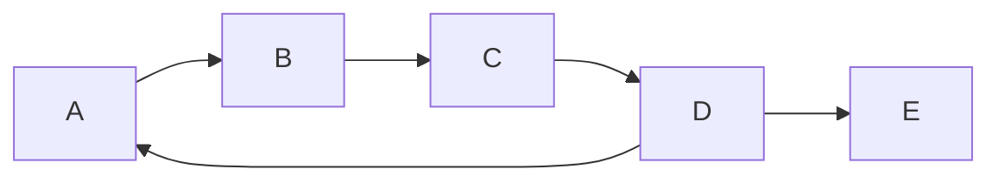
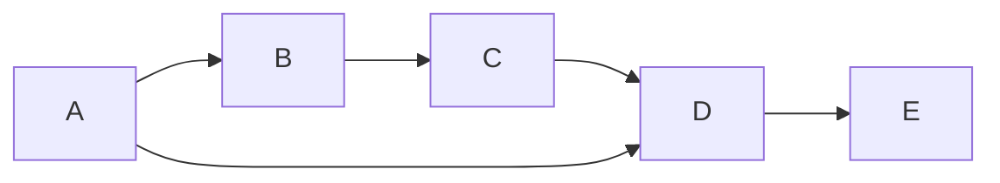

# Grafos

<div class="abs-br m-6 flex gap-2">
  <a href="https://github.com/BRJoaquin" target="_blank" alt="GitHub"
    class="text-xl icon-btn opacity-50 !border-none !hover:text-white">
    <carbon-logo-github />
  </a>
</div>

<!--
The last comment block of each slide will be treated as slide notes. It will be visible and editable in Presenter Mode along with the slide. [Read more in the docs](https://sli.dev/guide/syntax.html#notes)
-->

---
preload: false
layout: iframe-right
url: https://graph-examples.uruguayan.ninja/pages/nested/index.html
---

# Grafos

Tipo abstracto de dato

Consiste en un conjunto de **nodos/vertices** y **aristas** que definen relaciones entre los nodos.

Las dos propiedades básicas de un grafo están dadas por la características de sus aristas:

- ➡️ Ordenación (direccionalidad)
- #️⃣ Ponderación 

<div class="abs-br m-4 flex gap-2">
  <a href="https://graph-examples.uruguayan.ninja/pages/nested/index.html" target="_blank" alt="GitHub"
    class="text-l icon-btn opacity-50 !border-none !hover:text-white">
    <zondicons:screen-full/>
  </a>
</div>

---
preload: false
layout: iframe-right
url: https://graph-examples.uruguayan.ninja/pages/graph-types/index.html
---

# Ordenación y Ponderación

4 combinaciones posibles

- **Dirigido** ➡️ : Las aristas tienen una dirección. Ejemplo: Instagram (seguir a alguien) 

- **No dirigido** : Las aristas no tienen una dirección (es en ambas direcciones). Ejemplo: Facebook (amistad)

- **Ponderado** 🏋️‍♀️ : Las aristas tienen un peso asociado. Ejemplo: Mapa de carreteras (distancia entre ciudades)

- **No ponderado** : Las aristas no tienen un peso asociado. Ejemplo: Arbol genealógico (parentesco)

<div class="abs-br m-4 flex gap-2">
  <a href="https://graph-examples.uruguayan.ninja/pages/graph-types/index.html" target="_blank" alt="GitHub"
    class="text-l icon-btn opacity-50 !border-none !hover:text-white">
    <zondicons:screen-full/>
  </a>
</div>

---
preload: false
layout: iframe-right
url: https://graph-examples.uruguayan.ninja/pages/density/index.html
---

# Densidad

Relación entre el número de aristas y el número de aristas posibles

- **Denso** : Donde la cantidad de aristas es similar al número de aristas posibles. O(A)≈O(V^2)
- **Disperso** : Donde la cantidad de aristas es muy pequeño en comparación con el número de aristas posibles. O(A)<<O(V^2)

<br>

> V = Número de vértices

<br>

> A = Número de aristas

¿Cuál es la cantidad de aristas posibles en un grafo? 🤔

<div class="abs-br m-4 flex gap-2">
  <a href="https://graph-examples.uruguayan.ninja/pages/density/index.html" target="_blank" alt="GitHub"
    class="text-l icon-btn opacity-50 !border-none !hover:text-white">
    <zondicons:screen-full/>
  </a>
</div>

---
preload: false
layout: iframe-right
url: https://graph-examples.uruguayan.ninja/pages/density/index.html
---

# Densidad

La densidad de un grafo es un indicador de la cantidad de información que puede contener.

Jugará un papel importante en el orden de los algoritmos 🕓 que se apliquen sobre el grafo y sobre todo
**cómo se implementan** 👩‍💻.

- **Disperso** = implementación con listas de adyacencia
- **Denso** = implementación con matrices de adyacencia

**Nota**: cabe destacar que en la práctica son muy pocos los grafos que son densos. Por qué?

<div class="abs-br m-4 flex gap-2">
  <a href="https://graph-examples.uruguayan.ninja/pages/density/index.html" target="_blank" alt="GitHub"
    class="text-l icon-btn opacity-50 !border-none !hover:text-white">
    <zondicons:screen-full/>
  </a>
</div>

---

# Ciclos

Cíclico o No Cíclico

Un grafo cíclico contiene al menos un ciclo, es decir un camino que comienza y termina en el mismo nodo.



Un grafo no cíclico no contiene ciclos.



<br>

> Un camino es un conjunto de aristas que conectan un nodo con otro. (no puede haber aristas repetidas)


---
layout: two-cols
---

<template v-slot:default>

# Lista de Adyacencia
Implementación más eficiente de un grafo

Una lista de adyacencia es un array de listas, una para cada nodo del grafo.

- Cada lista contiene los nodos adyacentes al nodo correspondiente (dado por el índice del array).
- Es una forma más eficiente de representar grafos dispersos ya que **no se almacenan aristas que no existen**.

</template>
<template v-slot:right>

# Matriz de Adyacencia
Implementación más simple de un grafo

Una matriz de adyacencia es una matriz cuadrada utilizada para representar un grafo finito. 

- Cada elemento de la matriz representa la arista (o ausencia) entre dos nodos (origen y destino).
- El valor del elemento indica si hay un arista entre esos nodos y en caso de ser ponderado, el peso de la arista.

<br>

> En caso de ser no dirigido, la matriz es simétrica.

</template>

---

# Matriz y Lista de Adyacencia

<div class="container flex justify-center items-center">
  
</div>


---


| Característica         | Lista de adyacencia   | Matriz de adyacencia |
|------------------------|-----------------------|----------------------|
| Espacio                | O(V + E)              | O(V^2)               |
| Búsqueda de adyacencia | O(degree(V))          | O(V)                 |
| Inserción de aristas   | O(1)                  | O(1)                 |
| Eliminación de aristas | O(degree(V))          | O(1)                 |
| Eficiencia             | Mejor para grafos dispersos | Mejor para grafos densos |

Donde:
- V es el número de vértices en el grafo.
- E es el número de aristas en el grafo.
- degree(V) es el grado del vértice V, es decir, el número de vecinos.

---

# Recorridas
BFS & DFS

Las recorridas son un algoritmo que permite recorrer un grafo de manera ordenada.
Existen dos tipos de recorridas:
- **BFS** (Breadth First Search o búsqueda en anchura) 
- **DFS** (Depth First Search o búsqueda en profundidad)

<br>
<div class="container flex justify-center items-center">
  
</div>
---

# BFS
Búsqueda en anchura

Explora un grafo visitando primero todos los vecinos de un nodo inicial antes de pasar a sus vecinos de segundo nivel y así sucesivamente.

<br>
<div class="container flex justify-center items-center">
  
</div>

<br>

> Es importante destacar que el algoritmo no tiene en cuenta el orden de los vecinos.

---

# BFS
Pseudocódigo

```
function BFS(start, graph)
  create a queue Q
  mark start as visited
  enqueue start into Q

  while Q is not empty
    dequeue a node N from Q
    process N

    for each neighbor of N
      if neighbor is not visited
        mark neighbor as visited
        enqueue neighbor into Q
  end while
end function
```
<br>

> Qué orden de complejidad tiene este algoritmo? 🤔

<br>

> Visualización: [https://www.cs.usfca.edu/~galles/visualization/BFS.html](https://www.cs.usfca.edu/~galles/visualization/BFS.html)

---

# BFS
Código

```cpp {all|1|4-7|10-11|14-15|17|19|20|25|26|27-28|all} {maxHeight:'400px'}
void Graph_BFS(Graph* g, int s)
{
    // Mark all the vertices as not visited
    bool visited[MAX_VERTICES];
    for (int i = 0; i < g->V; i++) {
        visited[i] = false;
    }
 
    // Create a queue for BFS
    int queue[MAX_VERTICES];
    int front = 0, rear = 0;
 
    // Mark the current node as visited and enqueue it
    visited[s] = true;
    queue[rear++] = s;
 
    while (front != rear) {
        // Dequeue a vertex from queue and print it
        s = queue[front++];
        printf("%d ", s);
 
        // Get all adjacent vertices of the dequeued
        // vertex s. If a adjacent has not been visited,
        // then mark it visited and enqueue it
        for (int adjacent = 0; adjacent < g->V; adjacent++) {
            if (g->adj[s][adjacent] && !visited[adjacent]) {
                visited[adjacent] = true;
                queue[rear++] = adjacent;
            }
        }
    }
}
```

---

# BFS
Usos

- Para encontrar el camino más corto entre dos nodos (no ponderado).
- Busqueda de los K vecinos más cercanos.
- Para detectar si un grafo es bipartito.
- Para detectar si un grafo no dirigido es conexo.
- Detectar la cantidad de componentes conexos de un grafo no dirigido.

---

# DFS
Búsqueda en profundidad

Explora un grafo visitando un nodo inicial y luego yendo lo más profundo posible a lo largo de cada rama antes de retroceder. DFS puede no encontrar el camino más corto, pero es útil para explorar estructuras de datos más complejas y detectar ciclos.

<br>
<div class="container flex justify-center items-center">
  
</div>

<br>

> Es importante destacar que el algoritmo no tiene en cuenta el orden de los vecinos.

---

# DFS
Pseudocódigo

```
function DFS(start, graph)
  mark start as visited
  process start

  for each neighbor of start
    if neighbor is not visited
      call DFS(neighbor, graph)
    end if
  end for
end function
```
<br>

> Qué orden de complejidad tiene este algoritmo? 🤔

<br>

> Visualización: [https://www.cs.usfca.edu/~galles/visualization/DFS.html](https://www.cs.usfca.edu/~galles/visualization/DFS.html)

---

# DFS
Código

```cpp {all|5|6|10-11|12-13|all} {maxHeight:'400px'}
void Graph::DFS(int v)
{
    // Mark the current node as visited and
    // print it
    visited[v] = true;
    cout << v << " ";
 
    // Recur for all the vertices adjacent
    // to this vertex
    list<int>::iterator i;
    for (i = adj[v].begin(); i != adj[v].end(); ++i)
        if (!visited[*i])
            DFS(*i);
}
```

---

# DFS
Usos

- Para detectar ciclos en un grafo.
- Para detectar componentes fuertemente conexas en un grafo dirigido. [Algoritmo de Kosaraju](https://www.geeksforgeeks.org/strongly-connected-components/).
- Para detectar si un grafo no dirigido es conexo.
- Detectar la cantidad de componentes conexos de un grafo no dirigido.

---

# Orden topológico
Qué es un orden topológico?

Un ordenamiento topológico de un grafo dirigido es **una** secuencia lineal de sus vértices.

- Es útil para resolver problemas que involucran dependencias entre tareas.
- Solo es posible si el grafo es un DAG (Directed Acyclic Graph).

<br>
<div class="container flex justify-center items-center">
  
</div>
<br>

> Si el grafo tiene ciclos, no existe un orden topológico.

---

# Orden topológico
Pseudocódigo

- Encuentra nodos sin aristas entrantes, añádelos a conjunto S.
- Mientras S no esté vacío:
    - Elije un nodo N de S, añádelo a lista L.
    - Elimina aristas de N a vecinos, añade vecinos sin aristas entrantes a S.
- Si todas las aristas eliminadas, L es el orden topológico.

<br>

> Indegree: número de aristas entrantes a un nodo.

<br>

> Visualización: https://www.cs.usfca.edu/~galles/visualization/TopoSortIndegree.html

---

# Orden topológico
Algoritmo de Kahn

```cpp {all|7-25|27-36|40|46|52-57|61-64|67|72|78|82-84|91-92|95-96|78|102|108-110|all} {maxHeight:'400px'}
// A C++ program to print topological
// sorting of a graph using indegrees.
#include <bits/stdc++.h>
using namespace std;
 
// Class to represent a graph
class Graph {
    // No. of vertices'
    int V;
 
    // Pointer to an array containing
    // adjacency listsList
    list<int>* adj;
 
public:
    // Constructor
    Graph(int V);
 
    // Function to add an edge to graph
    void addEdge(int u, int v);
 
    // prints a Topological Sort of
    // the complete graph
    void topologicalSort();
};
 
Graph::Graph(int V)
{
    this->V = V;
    adj = new list<int>[V];
}
 
void Graph::addEdge(int u, int v)
{
    adj[u].push_back(v);
}
 
// The function to do
// Topological Sort.
void Graph::topologicalSort()
{
    // Create a vector to store
    // indegrees of all
    // vertices. Initialize all
    // indegrees as 0.
    vector<int> in_degree(V, 0);
 
    // Traverse adjacency lists
    // to fill indegrees of
    // vertices.  This step
    // takes O(V+E) time
    for (int u = 0; u < V; u++) {
        list<int>::iterator itr;
        for (itr = adj[u].begin();
             itr != adj[u].end(); itr++)
            in_degree[*itr]++;
    }
 
    // Create an queue and enqueue
    // all vertices with indegree 0
    queue<int> q;
    for (int i = 0; i < V; i++)
        if (in_degree[i] == 0)
            q.push(i);
 
    // Initialize count of visited vertices
    int cnt = 0;
 
    // Create a vector to store
    // result (A topological
    // ordering of the vertices)
    vector<int> top_order;
 
    // One by one dequeue vertices
    // from queue and enqueue
    // adjacents if indegree of
    // adjacent becomes 0
    while (!q.empty()) {
        // Extract front of queue
        // (or perform dequeue)
        // and add it to topological order
        int u = q.front();
        q.pop();
        top_order.push_back(u);
 
        // Iterate through all its
        // neighbouring nodes
        // of dequeued node u and
        // decrease their in-degree
        // by 1
        list<int>::iterator itr;
        for (itr = adj[u].begin(); itr != adj[u].end(); itr++)
            // If in-degree becomes zero,
            // add it to queue
            if (--in_degree[*itr] == 0)
                q.push(*itr);
 
        cnt++;
    }
 
    // Check if there was a cycle
    if (cnt != V) {
        cout << "There exists a cycle in the graph\n";
        return;
    }
 
    // Print topological order
    for (int i = 0; i < top_order.size(); i++)
        cout << top_order[i] << " ";
    cout << endl;
}
 
// Driver program to test above functions
int main()
{
    // Create a graph given in the
    // above diagram
    Graph g(6);
    g.addEdge(5, 2);
    g.addEdge(5, 0);
    g.addEdge(4, 0);
    g.addEdge(4, 1);
    g.addEdge(2, 3);
    g.addEdge(3, 1);
 
    cout << "Following is a Topological Sort of\n";
    g.topologicalSort();
 
    return 0;
}
```

--- 
layout: center
class: text-center
---

# Caminos más cortos

---

# Caminos más cortos
Qué es un camino más corto?

- El problema de los caminos más cortos es encontrar el camino más corto (peso) entre dos vértices en un grafo o entre todos los pares de vértices.
- Para grafos no ponderados, el problema de los caminos más cortos es equivalente al problema de la búsqueda en profundidad o en anchura (BFS). Se puede resolver en tiempo lineal.

<br>
<div class="container flex justify-center items-center">
  
</div>

---

# Edsger W. Dijkstra
Científico de la computación holandés

- Conocido por su trabajo en el diseño de algoritmos y estructuras de datos. 
- Ganador del Premio Turing en 1972.
- Dijkstra escribió más de 1.300 cartas llamadas "Manuscritos de EWD" a mano, que compartió con colegas y estudiantes.

---
layout: quote
---

# EWD 898
"La pregunta de si las máquinas pueden pensar es tan relevante como la pregunta de si los submarinos pueden nadar."

# EWD 936
"No es que no confíe en las máquinas, es que no confío en el hombre que usa las máquinas."

<br>
<div class="container flex justify-center items-center">
  
</div>

---

# Algoritmo de Dijkstra
Camino más corto desde un vértice a todos los demás

- El algoritmo de Dijkstra es un algoritmo de búsqueda de caminos más cortos en grafos ponderados.
- Tiene un tiempo de ejecución de $O(|E| + |V| log |V|)$ con una implementación de cola de prioridad (heap binario).

<br>

> Nota: El algoritmo de Dijkstra no funciona con grafos dirigidos con aristas de peso negativo.

---

# Algoritmo de Dijkstra
Idea general

Dijkstra es un algoritmo para encontrar el camino más corto en un grafo ponderado y dirigido.

1. Inicializa distancias y visitados. Distancia de origen a origen es 0, y a todos los demás es infinito. Ningún nodo está visitado.
2. Selecciona el nodo no visitado con la menor distancia.
3. Actualiza distancias de nodos adyacentes.
4. Marca el nodo como visitado.
5. Repite (desde el punto 2) hasta que todos los nodos estén visitados.

<br>

> Visualización: https://www.cs.usfca.edu/~galles/visualization/Dijkstra.html
---

# Algoritmo de Dijkstra
Analisis de complejidad

En términos sencillos, el algoritmo de Dijkstra tiene dos componentes principales que contribuyen a su complejidad en tiempo:

Procesar todos los vértices ($|V|$): Dijkstra explora cada vértice del grafo una vez, seleccionando el vértice con la distancia más corta conocida desde el nodo de inicio que aún no ha sido visitado. La selección del vértice mínimo puede implementarse usando una estructura de datos como el heap binario, que puede hacer esta operación en tiempo logarítmico ($log |V|$). Por lo tanto, esta parte de la complejidad en tiempo es $O(|V| log |V|)$. ``Basicamente vaciar el heap``

Procesar todas las aristas ($|E|$): Para cada vértice seleccionado, el algoritmo de Dijkstra actualiza las distancias de los vértices adyacentes (vecinos) si se encuentra un camino más corto. En el peor de los casos, podría haber que procesar todas las aristas del grafo. Esta parte de la complejidad en tiempo es $O(|E|)$.


---
layout: center
class: text-center
---

# Learn More

<!-- [Documentations](https://sli.dev) · [GitHub](https://github.com/slidevjs/slidev) · [Showcases](https://sli.dev/showcases.html) -->
