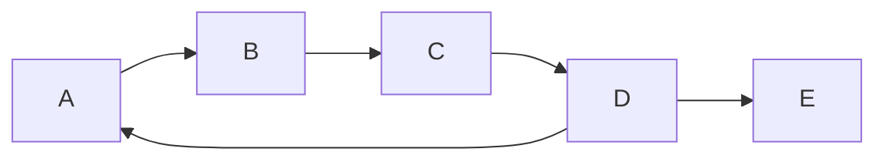
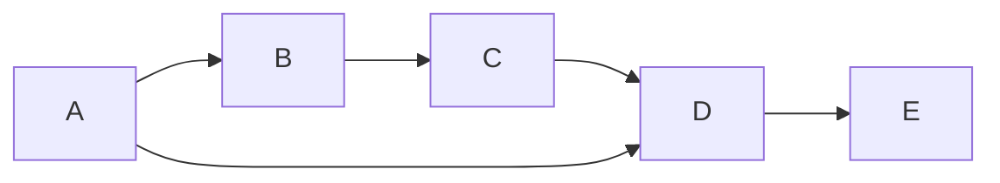
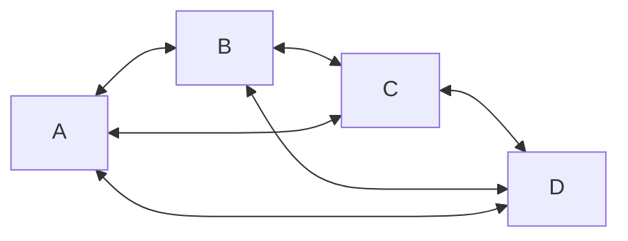
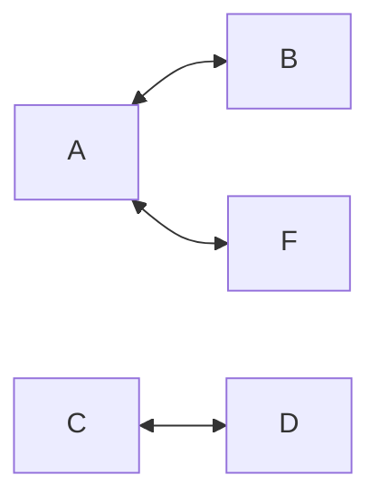
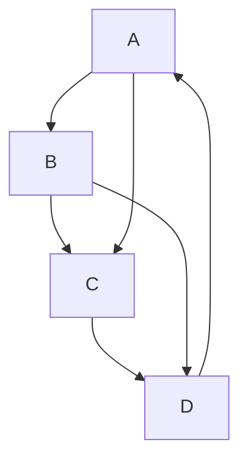
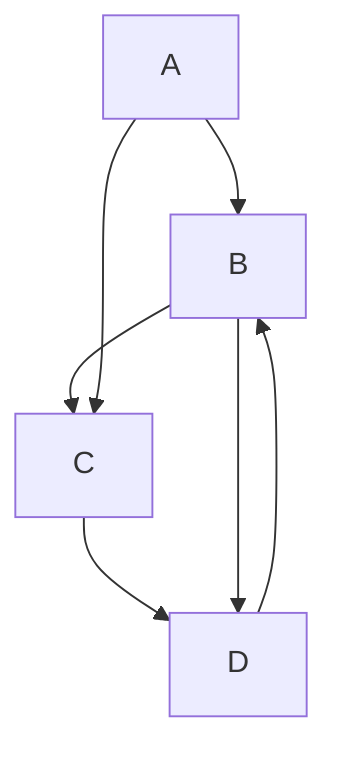
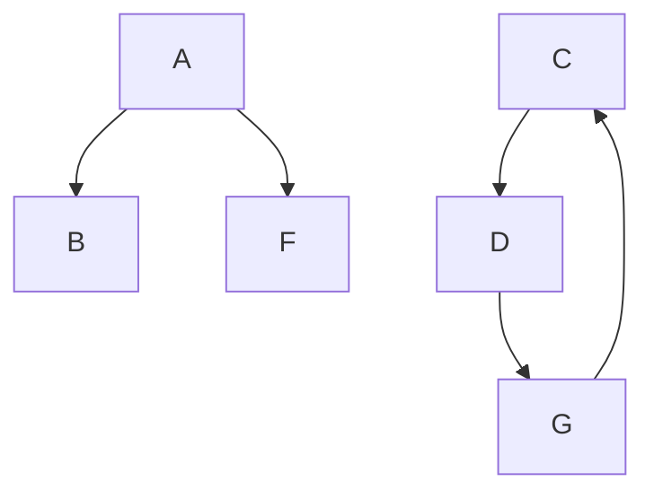

# Grafos

<div class="abs-br m-6 flex gap-2">
  <a href="https://github.com/BRJoaquin" target="_blank" alt="GitHub"
    class="text-xl icon-btn opacity-50 !border-none !hover:text-white">
    <carbon-logo-github />
  </a>
</div>

<!--
The last comment block of each slide will be treated as slide notes. It will be visible and editable in Presenter Mode along with the slide. [Read more in the docs](https://sli.dev/guide/syntax.html#notes)
-->

---
preload: false
layout: iframe-right
url: https://graph-examples.uruguayan.ninja/pages/nested/index.html
---

# Grafos

Tipo abstracto de dato

Consiste en un conjunto de **nodos/vertices** y **aristas** que definen relaciones entre los nodos.

- **Nodo/Vertice** : Representa un objeto o entidad.
- **Arista** : Representa una relación entre dos nodos.

Vamos a denotar $V$ a la cantidad de nodos y $A$ a la cantidad de aristas.

---
preload: false
layout: iframe-right
url: https://graph-examples.uruguayan.ninja/pages/graph-types/index.html
---

# Grafos

Primeras clasificaciones

Las dos propiedades básicas de un grafo están dadas por la características de sus aristas:

- ➡️ Ordenación (direccionalidad)
- #️⃣ Ponderación 

---
preload: false
layout: iframe-right
url: https://graph-examples.uruguayan.ninja/pages/graph-types/index.html
---

# Ordenación y Ponderación

4 combinaciones posibles

- **Dirigido** ➡️ : Las aristas tienen una dirección. Ejemplo: Instagram (seguir a alguien) 

- **No dirigido** : Las aristas no tienen una dirección (es en ambas direcciones). Ejemplo: Facebook (amistad)

- **Ponderado** 🏋️‍♀️ : Las aristas tienen un peso asociado. Ejemplo: Mapa de carreteras (distancia entre ciudades)

- **No ponderado** : Las aristas no tienen un peso asociado. Ejemplo: Arbol genealógico (parentesco)


<footer class="absolute bottom-0 left-0 right-0 p-2">
    <div class="text-center text-sm text-white">
        <a href="https://graph-examples.uruguayan.ninja/pages/graph-types/index.html" target="_blank" class="underline">Ver más ejemplos</a>
    </div>
</footer>

---
preload: false
layout: iframe-right
url: https://graph-examples.uruguayan.ninja/pages/density/index.html
---

# Densidad

Relación entre el número de aristas y el número de aristas posibles

- **Denso** : Donde la cantidad de aristas es similar al número de aristas posibles. O(A)≈O(V^2)
- **Disperso** : Donde la cantidad de aristas es muy pequeño en comparación con el número de aristas posibles. O(A)<<O(V^2)


¿Cuál es la cantidad de aristas posibles en un grafo? 🤔 

- En un grafo no dirigido: <v-click> $\frac{V(V-1)}{2}$ || $\frac{V(V+1)}{2}$ </v-click>
- En un grafo dirigido: <v-click> $V(V-1)$ || $V^2$ </v-click>


---
preload: false
layout: iframe-right
url: https://graph-examples.uruguayan.ninja/pages/density/index.html
---

# Densidad

La densidad de un grafo es un indicador de la cantidad de información que puede contener.

Jugará un papel importante en el orden de los algoritmos 🕓 que se apliquen sobre el grafo y sobre todo
**cómo se implementan** 👩‍💻.

- **Disperso** = implementación con listas de adyacencia
- **Denso** = implementación con matrices de adyacencia

**Nota**: cabe destacar que en la práctica son muy pocos los grafos que son densos. Por qué?

---

# Ciclos

Cíclico o Acíclico

Un grafo cíclico contiene al menos un ciclo, es decir un camino que comienza y termina en el mismo nodo.



Un grafo no cíclico no contiene ciclos.



<br>

> Un camino es un conjunto de aristas que conectan un nodo con otro. (no puede haber aristas repetidas)

<br>

> Tener en cuenta: un grafo no dirigido no necesariamente es cíclico.


---

# Conexidad
Cómo se disponen los nodos de un grafo

## Grafo no dirigido

- Conexo: Existe un camino entre cualquier par de nodos.
- No conexo: Existen nodos que no están conectados.

<br>

## Grafo dirigido

- Fuertemente conexo: Existe un camino entre cualquier par de nodos.
- Débilmente conexo: Existe un camino entre cualquier par de nodos si se considera el grafo dirigido subyacente.
- No conexo: Existen nodos que no están conectados, independientemente de la dirección de las aristas.

---



---



---



---



---



---

# Resumen de clasificaciones
El primer paso es identificar las características del grafo

Hasta ahora podemos clasificar un grafo por:
- **Ordenación** (dirigido o no dirigido)
- **Ponderación** (ponderado o no ponderado)
- **Densidad** (denso o disperso)
- **Ciclos** (cíclico o acíclico)
- **Conexidad** (conexo o no conexo)


---
layout: section
---

# Implementaciones
Lista de Adyacencia vs Matriz de Adyacencia

Tenemos dos formas de representar un grafo en nuestro programa. 
<v-click> Cada una tiene sus <span v-mark="{at:1, color: 'blue', type: 'highlight', animationDuration: 4000 }"> ventajas y desventajas.</span> </v-click>

---
layout: two-cols
---

<template v-slot:default>

# Lista de Adyacencia
Implementación eficiente de un grafo

Una lista de adyacencia es un array de listas, cada celda representa un nodo y cada lista contiene los nodos adyacentes a desde ese nodo.

- Cada lista contiene los nodos adyacentes al nodo correspondiente (dado por el índice del array).
- Es una forma eficiente (memoria) de representar grafos dispersos ya que **no se almacenan aristas que no existen**.

<br>

> En caso de ser no dirigido, una arista se representa dos veces.

</template>
<template v-slot:right>

# Matriz de Adyacencia
Implementación simple de un grafo

Una matriz de adyacencia es una matriz cuadrada utilizada para representar un grafo. 

- Cada elemento de la matriz representa la arista (o ausencia) entre dos nodos (origen y destino).
- El valor del elemento indica si hay un arista entre esos nodos y en caso de ser ponderado, el peso de la arista.

<br>

> En caso de ser no dirigido, la matriz es simétrica.

</template>

---

# Matriz y Lista de Adyacencia

<div class="container flex justify-center items-center">
  
</div>


---

# Lista de Adyacencia
Operaciones básicas

- **Inserción de aristas**: Agregar un nodo a la lista de adyacencia de otro nodo.
- **Eliminación de aristas**: Eliminar un nodo de la lista de adyacencia de otro nodo.
- **Búsqueda de adyacencia**: Para saber si existe la arista A->B, se busca en la lista de adyacencia de A que contenga a B.

## Preguntas

- ¿Qué contiene cada nodo de la lista de adyacencia?
- ¿Cómo se representa un grafo no dirigido?

<div class="abs-br m-6 flex gap-2">
  
</div>

---

<<< @/snippets/lista_ady.cpp {all|5-10|13-15|17-19|26-30|all}{maxHeight:'500px'}

---

# Matriz de Adyacencia
Operaciones básicas

- **Inserción de aristas**: Cambiar el valor de la matriz en la posición correspondiente.
- **Eliminación de aristas**: Cambiar el valor de la matriz en la posición correspondiente.
- **Búsqueda de adyacencia**: Para saber si existe la arista A->B, se busca en la matriz en la posición A,B.

## Preguntas
- ¿Qué representa el valor de la matriz?
    - ¿Qué valor se le asigna si no hay arista?
    - ¿Qué valor se le asigna si hay arista?
    - ¿Qué valor se le asigna si es ponderado?
    - ¿Qué valor se le asigna si es no ponderado?  
- ¿Cómo se representa un grafo no dirigido?

<div class="abs-br m-6 flex gap-2">
  
</div>

---

<<< @/snippets/matriz_ady.cpp {all|4|7-9|11-20|31-35|all}{maxHeight:'500px'}

---


| Característica         | Lista de adyacencia     | Matriz de adyacencia   |
|------------------------|-------------------------|------------------------|
| Espacio                | $O(V + A)$              | $O(V^2)$               |
| Búsqueda de adyacencia | $O(degree_{out}(V))$    | $O(V)$                 |
| Inserción de aristas   | $O(1)$*                 | $O(1)$                 |
| Eliminación de aristas | $O(degree_{out}(V))$    | $O(1)$                 |
| Eficiencia             | <span v-mark.circle.red>Mejor para grafos dispersos</span> | <span v-mark.circle.blue>Mejor para grafos densos</span> |

Donde:
- $degree_{out}$ es el grado de salida de un nodo.

<footer class="absolute bottom-0 left-0 right-0 p-2">
    (*) Asumiendo que no hay aristas repetidas.
</footer>

---

# Recorridas
BFS & DFS

Las recorridas son un algoritmo que permite recorrer un grafo de manera ordenada.
Existen dos tipos de recorridas:
- **BFS** (Breadth First Search o búsqueda en anchura) 
- **DFS** (Depth First Search o búsqueda en profundidad)

<br>
<div class="container flex justify-center items-center">
  
</div>
---

# BFS
Búsqueda en anchura

Explora un grafo visitando primero todos los vecinos de un nodo inicial antes de pasar a sus vecinos de segundo nivel y así sucesivamente.

<br>
<div class="container flex justify-center items-center">
  
</div>

<br>

> Es importante destacar que el algoritmo no tiene en cuenta el orden de los vecinos.

---

# BFS
Pseudocódigo

```
function BFS(start, graph)
  create a queue Q
  mark start as visited
  enqueue start into Q

  while Q is not empty
    dequeue a node N from Q
    process N

    for each neighbor of N
      if neighbor is not visited
        mark neighbor as visited
        enqueue neighbor into Q
  end while
end function
```
<br>

> Qué orden de complejidad tiene este algoritmo? 🤔

<br>

> Visualización: [https://www.cs.usfca.edu/~galles/visualization/BFS.html](https://www.cs.usfca.edu/~galles/visualization/BFS.html)

---

# BFS
Código

<<< @/snippets/bfs.cpp {all|3-7|8-10|11-29|11|13-15|16|18-28|21-22|23-27|all}{maxHeight:'400px'}

---

# BFS
Usos

- Para encontrar el camino más corto entre dos nodos (no ponderado).
- Busqueda de los K vecinos más cercanos.
- Para detectar si un grafo es bipartito.
- Para detectar si un grafo no dirigido es conexo.
- Detectar la cantidad de componentes conexos de un grafo no dirigido.

---

# DFS
Búsqueda en profundidad

Explora un grafo visitando un nodo inicial y luego yendo lo más profundo posible a lo largo de cada rama antes de retroceder. DFS puede no encontrar el camino más corto, pero es útil para explorar estructuras de datos más complejas y detectar ciclos.

<br>
<div class="container flex justify-center items-center">
  
</div>

<br>

> Es importante destacar que el algoritmo no tiene en cuenta el orden de los vecinos.

---

# DFS
Pseudocódigo

```
function DFS(start, graph)
  mark start as visited
  process start

  for each neighbor of start
    if neighbor is not visited
      call DFS(neighbor, graph)
    end if
  end for
end function
```
<br>

> Qué orden de complejidad tiene este algoritmo? 🤔

<br>

> Visualización: [https://www.cs.usfca.edu/~galles/visualization/DFS.html](https://www.cs.usfca.edu/~galles/visualization/DFS.html)

---

# DFS
Código

<<< @/snippets/dfs.cpp {all|1-8|3-5|6|10-24|12|13|15-23|20-23|22|all}{maxHeight:'400px'}

---

# DFS
Usos

- Para detectar ciclos en un grafo.
- Para detectar componentes fuertemente conexas en un grafo dirigido. [Algoritmo de Kosaraju](https://www.geeksforgeeks.org/strongly-connected-components/).
- Para detectar si un grafo no dirigido es conexo.
- Detectar la cantidad de componentes conexos de un grafo no dirigido.

---

# Orden topológico
Qué es un orden topológico?

Un ordenamiento topológico de un grafo dirigido es **una** secuencia lineal de sus vértices.

- Es útil para resolver problemas que involucran dependencias entre tareas.
- Solo es posible si el grafo es un DAG (Directed Acyclic Graph).

<br>
<div class="container flex justify-center items-center">
  
</div>
<br>

> ⚠️ Si el grafo tiene ciclos, no existe un orden topológico.

---

# Orden topológico
Pseudocódigo

- Encuentra nodos sin aristas entrantes, añádelos a conjunto S.
- Mientras S no esté vacío:
    - Elije un nodo N de S, añádelo a lista L.
    - Elimina aristas de N a vecinos, añade vecinos sin aristas entrantes a S.
- Si todas las aristas eliminadas, L es el orden topológico.

<br>

> Indegree: número de aristas entrantes a un nodo.

<br>

> Visualización: https://www.cs.usfca.edu/~galles/visualization/TopoSortIndegree.html

---

# Orden topológico
Algoritmo de Kahn

<<< @/snippets/kahn.cpp {all|3|5-13|10|15-20|22-37|24|26|28-35|32|33|28-35|all}{maxHeight:'400px'}

--- 
layout: center
class: text-center
---

# Caminos más cortos

---

# Caminos más cortos
Qué es un camino más corto?

- El problema de los caminos más cortos es encontrar el camino más corto (peso) entre dos vértices en un grafo o entre todos los pares de vértices.
- Para grafos no ponderados, el problema de los caminos más cortos es equivalente al problema de la búsqueda en profundidad o en anchura (BFS). Se puede resolver en tiempo lineal.

<br>
<div class="container flex justify-center items-center">
  
</div>

---

# Edsger W. Dijkstra
Científico de la computación holandés

- Conocido por su trabajo en el diseño de algoritmos y estructuras de datos. 
- Ganador del Premio Turing en 1972.
- Dijkstra escribió más de 1.300 cartas llamadas "Manuscritos de EWD" a mano, que compartió con colegas y estudiantes.

---
layout: quote
---

# EWD 898
"La pregunta de si las máquinas pueden pensar es tan relevante como la pregunta de si los submarinos pueden nadar."

# EWD 936
"No es que no confíe en las máquinas, es que no confío en el hombre que usa las máquinas."

<br>
<div class="container flex justify-center items-center">
  
</div>

---

# Algoritmo de Dijkstra
Camino más corto desde un vértice a todos los demás

- El algoritmo de Dijkstra es un algoritmo de búsqueda de caminos más cortos en grafos ponderados.
- Tiene un tiempo de ejecución de $O((|E| + |V|) log |V|)$ con una implementación de cola de prioridad (heap binario).

<br>

> 🛑 Nota: El algoritmo de Dijkstra no funciona con grafos dirigidos con aristas de peso negativo.

---

# Algoritmo de Dijkstra
Idea general

Dijkstra es un algoritmo para encontrar el camino más corto en un grafo ponderado y dirigido.

1. Inicializa distancias y visitados. Distancia de origen a origen es 0, y a todos los demás es infinito. Ningún nodo está visitado.
2. Selecciona el nodo no visitado con la menor distancia.
3. Actualiza distancias de nodos adyacentes.
4. Marca el nodo como visitado.
5. Repite (desde el punto 2) hasta que todos los nodos estén visitados.

<br>

> Visualización: https://www.cs.usfca.edu/~galles/visualization/Dijkstra.html

--- 

# Algoritmo de Dijkstra
Código (versión simple)

<<< @/snippets/dijkstra_v1.cpp {all|3-5|7-11|12|14-44|14|16-22|24-26|28-29|32-44|38|39-40|46-47|all}{maxHeight:'400px'}

---

# Algoritmo de Dijkstra
Código (versión heap)

<<< @/snippets/dijkstra_v2.cpp {all|1-6|9-11|13|15-17|19-23|24|26|27|29-49|30-32|34|35|37-49|39-41|44|45-47|53-54|all}{maxHeight:'400px'}

---

# Algoritmo de Dijkstra
Analisis de complejidad

En términos sencillos, el algoritmo de Dijkstra tiene dos componentes principales que contribuyen a su complejidad en tiempo:

Procesar todos los vértices ($|V|$): Dijkstra explora cada vértice del grafo una vez, seleccionando el vértice con la distancia más corta conocida desde el nodo de inicio que aún no ha sido visitado. La selección del vértice mínimo puede implementarse usando una estructura de datos como el heap binario, que puede hacer esta operación en tiempo logarítmico ($log |V|$). Por lo tanto, esta parte de la complejidad en tiempo es $O(|V| log |V|)$. ``Basicamente vaciar el heap``

Procesar todas las aristas ($|E|$): Para cada vértice seleccionado, el algoritmo de Dijkstra actualiza las distancias de los vértices adyacentes (vecinos) si se encuentra un camino más corto. En el peor de los casos, podría haber que procesar todas las aristas del grafo. Esta parte de la complejidad en tiempo es $O(|E|)$ * el tiempo de actualizar la prioridad en el heap ($log |V|$).

---

# Bellman-Ford
Camino más corto desde un vértice a todos los demás

- A diferencia del algoritmo de Dijkstra, el algoritmo de Bellman-Ford puede manejar grafos dirigidos con aristas de peso negativo.
- Con el algoritmo de Bellman-Ford, podemos encontrar el camino más corto desde un vértice a todos los demás.
- Tiene un tiempo de ejecución de $O(|V|.|E|)$.

---

# Bellman-Ford
Ideas generales

1. Inicializa distancias y visitados. Distancia de origen a origen es 0, y a todos los demás es infinito. Ningún nodo está visitado.
2. Inicializa una cola fifo con el nodo origen.
3. Mientras la cola no esté vacía, saca un nodo de la cola.
4. Para cada nodo adyacente, actualiza la distancia y de ser necesario (mejora el costo), agrega el nodo a la cola.


> El "problema" es que un nodo puede ser procesado multiples veces.

<br>

> Visualización: https://visualgo.net/en/sssp


---

# Bellman-Ford
Código

<<< @/snippets/bellman_ford.cpp {all|4-9|10|12-15|17-36|18|19|21|22-36|23-25|27|28-29|30-33|all}{maxHeight:'400px'}

---

# Floyd-Warshall
Camino más corto entre todos los pares de vértices

- El algoritmo de Floyd-Warshall es un algoritmo para encontrar el camino más corto entre todos los pares de vértices en un grafo ponderado.
- Puede manejar aristas de peso negativo, pero no ciclos negativos (un ciclo negativo es un ciclo cuya suma de pesos es negativa).
- Tiene un tiempo de ejecución de $O(|V|^3)$.
- Es un algoritmo muy simple y fácil de implementar.

---

# Floyd-Warshall
Idea general

1. Inicializa una matriz de distancias con los pesos de las aristas.
2. Para cada par de nodos, verifica si hay un camino más corto pasando por un nodo intermedio.
3. Actualiza la matriz de distancias si se encuentra un camino más corto.

<br>

> La matriz de distancias es una matriz cuadrada donde cada elemento $d_{ij}$ representa la distancia entre los nodos $i$ y $j$.

<footer class="absolute bottom-0 left-0 right-0 p-2">
    <a href="https://www.cs.usfca.edu/~galles/visualization/Floyd.html" target="_blank" class="underline">Visualización</a>
</footer>
    

---

# Floyd-Warshall
Código

<<< @/snippets/floyd_warshall.cpp {all|5-6|8-15|18-25|29-38|32|33-34|all}{maxHeight:'400px'}

---
layout: section
---

# Árbol de Cubrimiento Mínimo (MST)
Costo mínimo para conectar todos los nodos de un grafo

Veremos dos algoritmos para encontrar un árbol de cubrimiento mínimo en un grafo ponderado y no dirigido: 
<v-click><span v-mark="{at:1, color: 'blue', type: 'highlight', animationDuration: 2000 }">Prim</span></v-click>
<v-click> y <span v-mark="{at:2, color: 'red', type: 'highlight', animationDuration: 2000 }">Kruskal</span></v-click>

---

# Árbol de Cubrimiento Mínimo (MST)
Costo mínimo para conectar todos los nodos de un grafo

Un Árbol de Cubrimiento Mínimo es un subconjunto de aristas que conecta todos los vértices en un grafo sin ciclos y con el menor costo total posible. Los árboles de cubrimiento mínimo son fundamentales en 
aplicaciones como la planificación de redes de telecomunicaciones y la construcción de caminos eficientes. 

<v-click>Se aplican a grafos <span v-mark="{at:1, color: 'blue', type: 'highlight', animationDuration: 2000 }">no dirigidos y ponderados.</span></v-click>

<v-click>
    <div style="background-color: white; padding: 10px; margin-top: 15px;">
        
    </div>
</v-click>

---

# Prim

El algoritmo de Prim comienza con un vértice arbitrario y crece el MST una arista a la vez.

**Idea general**:

1. Inicia con un vértice.
2. Selecciona la arista más ligera conectada al MST que no forma un ciclo.
3. Añade el nuevo vértice al MST.
4. Repite hasta que todos los vértices estén incluidos en el MST.

<br>

> 👉 Este algoritmo es muy similar al algoritmo de Dijkstra, cambia solo un par de lineas de código.

<footer class="absolute bottom-0 left-0 right-0 p-2">
    <a href="https://www.cs.usfca.edu/~galles/visualization/Prim.html" target="_blank" class="underline">Visualización</a>
</footer>

---

# Prim - Código
Diferencia con Dijkstra

````md magic-move
```cpp
// Dijkstra
Iterator<Edge>* it = graph->adjacents(minIndex);
while (it->hasNext()) {
    Edge edge = it->next();
    int v = edge.to;
    int weight = edge.weight;

    if (!visited[v] && dist[v] > dist[minIndex] + weight) {
        dist[v] = dist[minIndex] + weight;
        parent[v] = minIndex;
    }
}
```
```cpp
// Prim
Iterator<Edge>* it = graph->adjacents(minIndex);
while (it->hasNext()) {
    Edge edge = it->next();
    int v = edge.to;
    int weight = edge.weight;

    if (!visited[v] && dist[v] > weight) {
        dist[v] = weight;
        parent[v] = minIndex;
    }
}
```
````

---

# Prim - Conclusiones
Las mismas que Dijkstra

- **Complejidad temporal**: $O(V^2)$ o $O((V+A) \log V)$ con cola de prioridad (min heap).
- **Estructura de datos**: Cola de prioridad (min heap) para mejorar la complejidad temporal.

<div style="background-color: white; padding: 10px; margin-top: 15px;">
    
</div>

---

# Kruskal
Arista por arista


Kruskal es un algoritmo que utiliza una estructura de datos llamada **conjunto disjunto** o **MFset** (Disjoint-set) para gestionar las uniones y las búsquedas de los conjuntos de vértices.

**Idea general**:

1. Ordena todas las aristas de menor a mayor peso.
2. Selecciona la arista con el menor peso.
3. Añade la arista al MST **si no forma un ciclo** .
4. Repite el proceso hasta $V-1$ aristas (si es conexo).

---

# Kruskal - Pseudocódigo

```
function Kruskal(graph)
  sort graph.edges by weight in ascending order

  initialize MST as an empty list of edges
  initialize a counter for edges added to MST, count = 0

  for each edge in graph.edges
    if adding edge does not form a cycle in MST
      add edge to MST
      increment count
    end if

    if count equals graph.vertices - 1
      break  // El MST está completo
    end if
  end for

  return MST
end function

```

---

# Conjunto Disjunto (MFset)
Estructura de datos

La estructura de **Conjunto Disjunto** se utiliza para mantener un conjunto de elementos particionados en subconjuntos no superpuestos.

**Operaciones básicas**:

- Find: 🔍 Determina el conjunto representativo de un elemento.
- Union/Merge: 🤝 Une dos subconjuntos en uno solo.


Existen dos mejoras para la implementación de Conjunto Disjunto:
- **Path Compression**: Reduce la altura de los árboles.
- **Union by Rank**: Une el árbol más pequeño al más grande.

<br>

> Vamos a necesitar estas dos mejoras para Kruskal y llegar en complejidad a $O(N \log N)$, siendo $N$ la cantidad de elementos en el conjunto.

<footer class="absolute bottom-0 left-0 right-0 p-2">
    <a href="https://www.cs.usfca.edu/~galles/visualization/DisjointSets.html" target="_blank" class="underline">Visualización</a>
</footer>
    

---

# Conjunto Disjunto (MFset) - Código v1
Versión simple

<<< @/snippets/disjoint_v1.cpp {all|4-5|8-14|16-19|22-30|all}{maxHeight:'400px'}

---

# Conjunto Disjunto (MFset) - Código v2
Versión con Path Compression y Union by Rank

<<< @/snippets/disjoint_v2.cpp {all|3-6|9-16|19-26|28-47|all}{maxHeight:'400px'}

---

# Kruskal - Código
Con Conjunto Disjunto

<<< @/snippets/kruskal.cpp {all|2-3|5-9|12-14|17|19-29|20-21|23|25-27|31|all}{maxHeight:'400px'}

---
