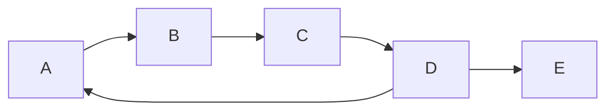
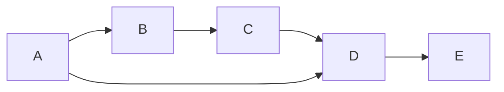

# Grafos

  <a href="https://github.com/BRJoaquin" target="_blank" alt="GitHub"
    class="text-xl icon-btn opacity-50 !border-none !hover:text-white">
    <carbon-logo-github />
  </a>

<!--
The last comment block of each slide will be treated as slide notes. It will be visible and editable in Presenter Mode along with the slide. [Read more in the docs](https://sli.dev/guide/syntax.html#notes)
-->

---
preload: false
layout: iframe-right
url: https://graph-examples.uruguayan.ninja/pages/nested/index.html
---

# Grafos

Tipo abstracto de dato

Consiste en un conjunto de **nodos/vertices** y **aristas** que definen relaciones entre los nodos.

Las dos propiedades básicas de un grafo están dadas por la características de sus aristas:

- ➡️ Ordenación (direccionalidad)
- #️⃣ Ponderación 

  <a href="https://graph-examples.uruguayan.ninja/pages/nested/index.html" target="_blank" alt="GitHub"
    class="text-l icon-btn opacity-50 !border-none !hover:text-white">
    <zondicons:screen-full/>
  </a>

---
preload: false
layout: iframe-right
url: https://graph-examples.uruguayan.ninja/pages/graph-types/index.html
---

# Ordenación y Ponderación

4 combinaciones posibles

- **Dirigido** ➡️ : Las aristas tienen una dirección. Ejemplo: Instagram (seguir a alguien) 

- **No dirigido** : Las aristas no tienen una dirección (es en ambas direcciones). Ejemplo: Facebook (amistad)

- **Ponderado** 🏋️‍♀️ : Las aristas tienen un peso asociado. Ejemplo: Mapa de carreteras (distancia entre ciudades)

- **No ponderado** : Las aristas no tienen un peso asociado. Ejemplo: Arbol genealógico (parentesco)

  <a href="https://graph-examples.uruguayan.ninja/pages/graph-types/index.html" target="_blank" alt="GitHub"
    class="text-l icon-btn opacity-50 !border-none !hover:text-white">
    <zondicons:screen-full/>
  </a>

---
preload: false
layout: iframe-right
url: https://graph-examples.uruguayan.ninja/pages/density/index.html
---

# Densidad

Relación entre el número de aristas y el número de aristas posibles

- **Denso** : Donde la cantidad de aristas es similar al número de aristas posibles. O(A)≈O(V^2)
- **Disperso** : Donde la cantidad de aristas es muy pequeño en comparación con el número de aristas posibles. O(A)<<O(V^2)

 

> V = Número de vértices

 

> A = Número de aristas

¿Cuál es la cantidad de aristas posibles en un grafo? 🤔

  <a href="https://graph-examples.uruguayan.ninja/pages/density/index.html" target="_blank" alt="GitHub"
    class="text-l icon-btn opacity-50 !border-none !hover:text-white">
    <zondicons:screen-full/>
  </a>

---
preload: false
layout: iframe-right
url: https://graph-examples.uruguayan.ninja/pages/density/index.html
---

# Densidad

La densidad de un grafo es un indicador de la cantidad de información que puede contener.

Jugará un papel importante en el orden de los algoritmos 🕓 que se apliquen sobre el grafo y sobre todo
**cómo se implementan** 👩‍💻.

- **Disperso** = implementación con listas de adyacencia
- **Denso** = implementación con matrices de adyacencia

**Nota**: cabe destacar que en la práctica son muy pocos los grafos que son densos. Por qué?

  <a href="https://graph-examples.uruguayan.ninja/pages/density/index.html" target="_blank" alt="GitHub"
    class="text-l icon-btn opacity-50 !border-none !hover:text-white">
    <zondicons:screen-full/>
  </a>

---

# Ciclos

Cíclico o No Cíclico

Un grafo cíclico contiene al menos un ciclo, es decir un camino que comienza y termina en el mismo nodo.

Un grafo no cíclico no contiene ciclos.

 

> Un camino es un conjunto de aristas que conectan un nodo con otro. (no puede haber aristas repetidas)

---
layout: two-cols
---

<template v-slot:default>

# Matriz de Adyacencia
Implementación más simple de un grafo

</template>
<template v-slot:right>

# Lista de Adyacencia
Implementación más eficiente de un grafo

</template>

---
layout: center
class: text-center
---

# Learn More

<!-- [Documentations](https://sli.dev) · [GitHub](https://github.com/slidevjs/slidev) · [Showcases](https://sli.dev/showcases.html) -->
